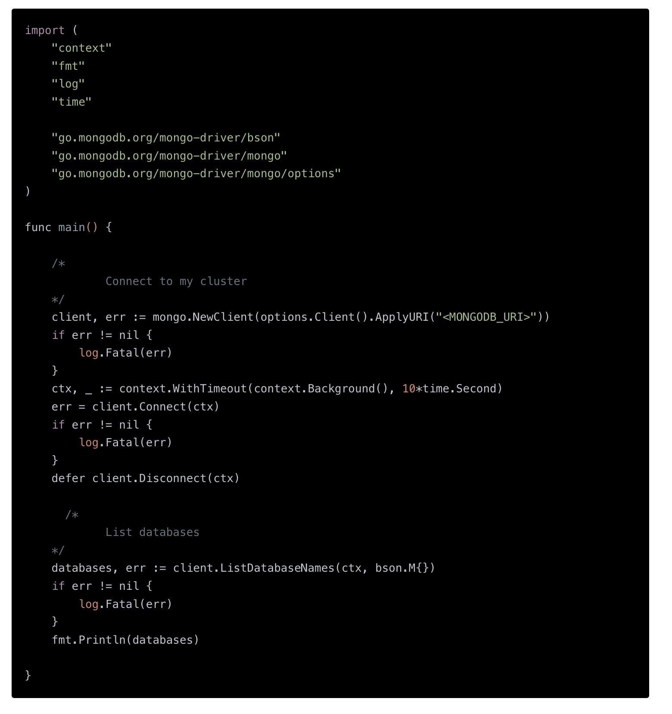
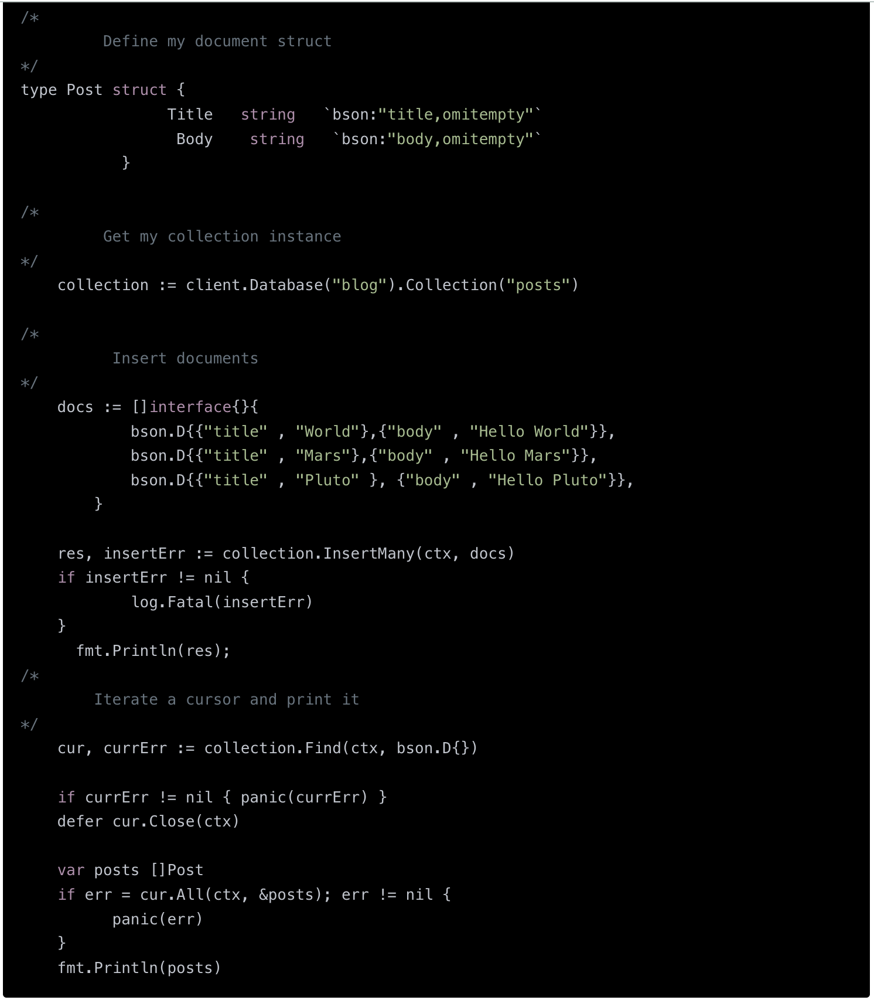
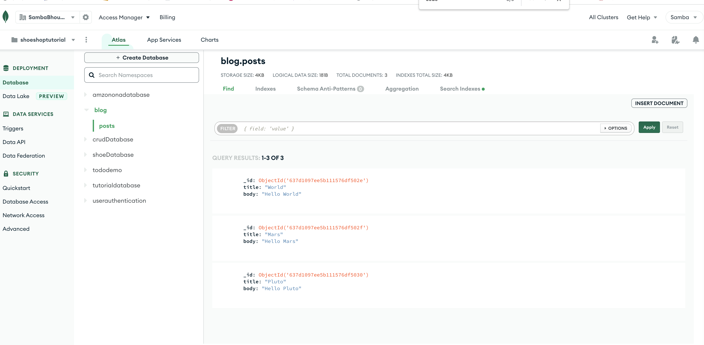
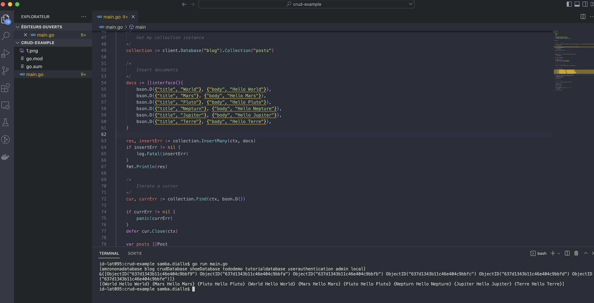

# How Does Golang Connect to MongoDB?
You’ll need to have Golang installed on your system, and either have MongoDB installed locally, or use MongoDB Atlas to start cloud-first.
 Next, install the standard MongoDB driver for Golang. (For more info on installing Go modules, check out https://blog.golang.org/using-go-modules):

# `Module to intall ..`

go get go.mongodb.org/mongo-driver/mongo

# `Here’s a code example for connecting to MongoDB in Go:`

# `When to Use MongoDB with Golang`

The MongoDB Go driver lets you integrate MongoDB into any application and tap into the impressive Go ecosystem.
There are numerous ways to create applications in Go to leverage MongoDB.
For server development, there are full-featured web frameworks like Revel and Gin, lightweight tools like Web.go, and even ultra-simple modular approaches like the Gorilla web toolkit.
For data science, Tools like Gopher Data, Gopher Notes, and Gota or qframe open up Golang to data.
For Machine Learning use cases, you should check out GoLearn.
# `Here is a code example that shows how to insert and query a set of documents.`

# `ScreenShot`

